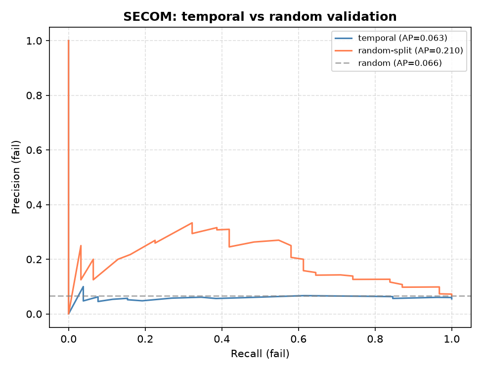
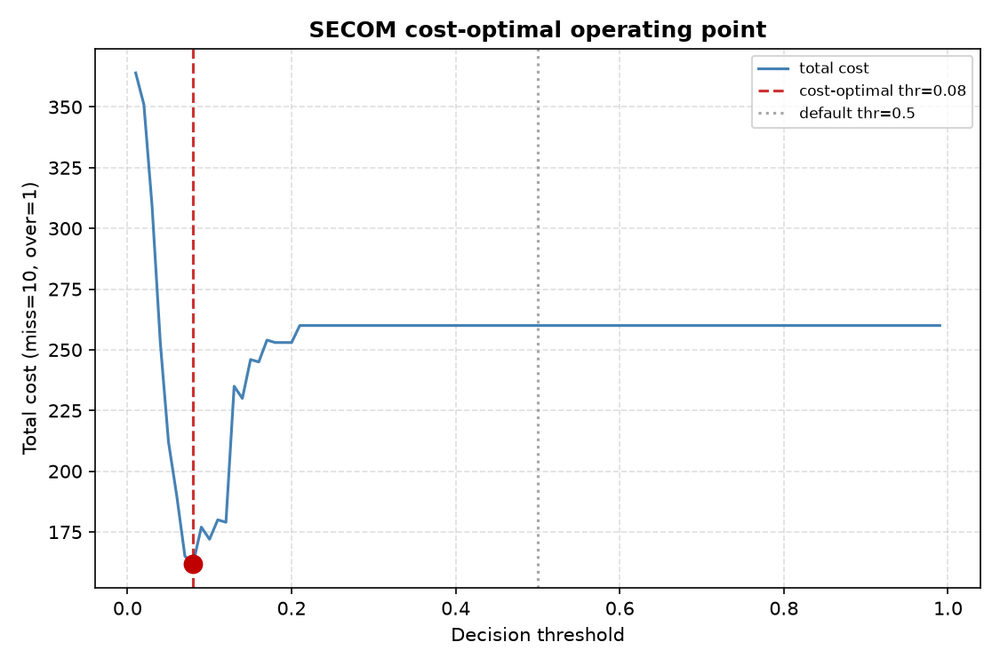
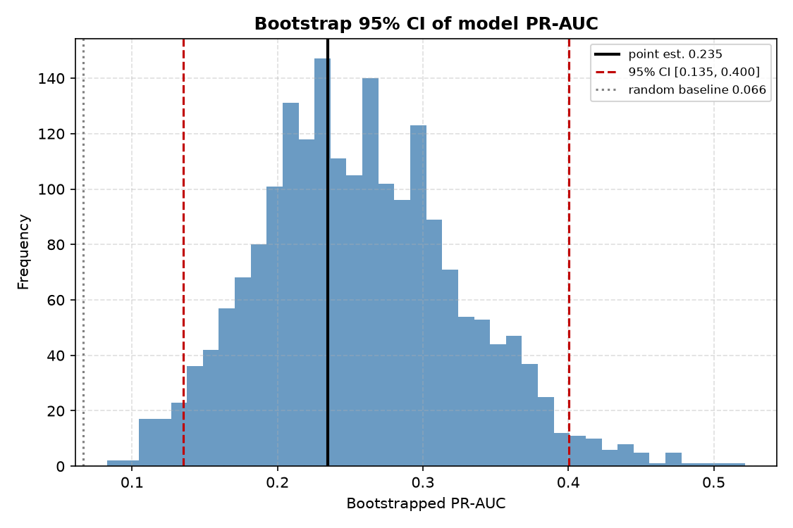
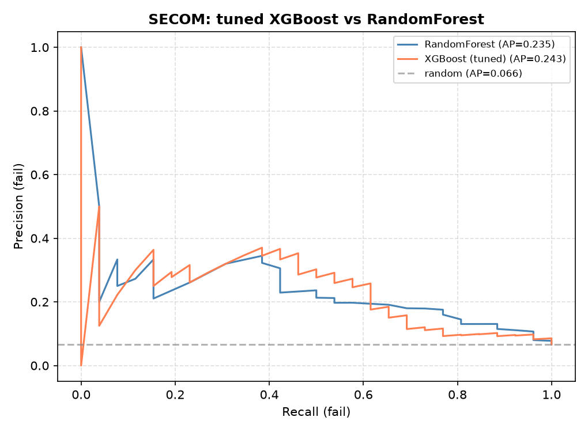

# 🔬 SECOM 반도체 수율 불량 예측 — 양산 배포 관점의 데이터 분석

> **“모델을 잘 만들었다”가 아니라 “실제 공장에 쓰면 어떻게 되는가”까지.**
> 실제 반도체 라인 계측 데이터(1,567런 × 590센서)로 수율 불량을 예측하고, 대부분의 튜토리얼이
> 놓치는 **정확도의 함정 · 모델 노후화 · 비용 기준 운영**을 수치로 규명한 포트폴리오입니다.


---

## 30초 요약

반도체 공장 계측 데이터로 불량을 예측하는 모델을 만들고, **그 모델을 양산에 배포했을 때의
현실**(시간에 따른 성능 붕괴, 비용 기준 운영점, 통계적 신뢰도)을 검증했습니다. 모든 수치는
재현 가능한 스크립트의 **실측값**입니다.

| 발견 | 수치 | 의미 |
|---|---|---|
| 🎯 정확도의 함정 | **93.4%** | 불량이 6.6%뿐이라 “전부 합격”만 찍어도 나오는 가짜 성적 |
| 📈 실제 판별력 (PR-AUC) | **0.235** (95% CI 0.14–0.40) | 무작위 기준 0.066의 **3.6배** |
| ⏳ 모델 노후화 | 0.21 → **0.06** | 시간순 검증 시 성능 붕괴 → **재학습 필요** |
| 💰 비용 최적 운영점 | **−38%** | 임계값 0.5→0.08, 유출:과검=10:1 비용 최소화 |
| 🌲 XGBoost 튜닝 | 0.147 → **0.243** | GridSearchCV로 +0.097, RandomForest(0.235) 상회 |
| 🔀 센서 랭킹 불안정 | Jaccard **0.03** | 전/후반 상위 20센서 겹침 1개 → 고정 관리 위험 |

---

## 1. Project Overview

- **Goal**: 대량 결측치(전체 4.5%·최대 센서 91%)와 극단적 불균형(불량 6.6%) 구조의 실제 반도체
  공정 데이터에서, 수율(Yield) 저하를 유발하는 유의미한 센서 변수를 선별하고, **양산 배포
  관점의 신뢰성**(시간축 안정성·비용 운영점·통계적 신뢰구간)까지 검증합니다.
- **Target JD Alignment**: **SK하이닉스 양산기술** — 양산 수율/품질 데이터 분석 · 불량 예측 ·
  SPC 기반 공정 모니터링 · 데이터 기반 의사결정 요건. (시각화는 Spotfire 트랙으로 확장 예정)

## 2. Key Troubleshooting (실측 근거)

1. **불균형(Imbalance)**: `SMOTE`를 관성적으로 적용하지 않고 `class_weight`와 **직접 비교·검증**
   → SMOTE의 PR-AUC 이득이 **−0.033**으로 오히려 나빠 기각, 비용가중을 채택.
2. **평가지표 함정**: 정확도 93.4%가 다수클래스에 지배됨을 확인 → 소수클래스 지표 **PR-AUC 0.235**
   로 전환(무작위 기준 0.066의 3.6배).
3. **특성 선택(Feature Selection)**: `VarianceThreshold(0.0)` + `RandomForest 중요도` +
   `Mann-Whitney U 검정(BH-FDR)` **3경로 교차검증** → 470센서 중 **21개** 유의(FDR<0.05),
   다중공선성(r>0.97)까지 점검.
4. **배포 현실 검증**: 무작위분할 PR-AUC 0.21이 **시간순 검증에서 0.06으로 붕괴** → 모델 노후화
   확인, 재학습 주기 필요성 도출.
5. **모델 최적화**: `XGBoost + GridSearchCV`(scoring=`average_precision`)로 **0.147 → 0.243**.

---

## 왜 이 프로젝트가 다른가

대부분의 SECOM 분석은 여기서 끝납니다: `결측치 대치 → RandomForest → 상위 50 피처 → SMOTE →
정확도 자랑`. 이 포트폴리오는 그 대신 **양산기술 엔지니어의 언어**로 재해석합니다.

| 항목 | 흔한 방식 | 이 프로젝트 | 결과 |
|---|---|---|---|
| 평가지표 | 정확도 | **PR-AUC** | 0.235 (3.6×) |
| 검증 | 무작위 분할 | **시간순 분할** | 0.21→0.06 붕괴 발견 |
| 특성선택 | RF 중요도만 | **U검정 + FDR 병행** | 21/470 유의 |
| 불균형 | SMOTE 관성 | **SMOTE 검증·기각** | −0.033 (이득 없음) |
| 운영 | 임계값 0.5 | **비용 운영점** | −38% 비용 |
| 신뢰도 | 점 추정 하나 | **부트스트랩 신뢰구간** | 우연/진짜 판정 |
| 모델 | 기본값 | **GridSearchCV 튜닝** | +0.097 |

---

## 결과 미리보기

| 시간순 검증 = 모델 노후화 | 비용 최적 운영점 |
|---|---|
|  |  |

| 부트스트랩 신뢰구간 (PR-AUC) | XGBoost(튜닝) vs RandomForest |
|---|---|
|  |  |

---

## 빠른 시작 (재현)

```bash
git clone <this-repo>
cd secom-yield-portfolio
pip install -r requirements.txt

# 공개데이터(UCI SECOM)는 public_data/secom/ 에 포함되어 있어 바로 실행 가능
python src/secom_analysis.py     # 베이스라인·PR-AUC·상위센서
python src/secom_eda.py          # 분포·박스플롯·통계검정 특성선택
python src/secom_drift.py        # 시간순 검증·SPC 관리도·센서 드리프트
python src/secom_advanced.py     # 비용 운영점·SMOTE 반박·피처 안정성
python src/secom_ci.py           # 부트스트랩 신뢰구간
python src/secom_xgb.py          # XGBoost + GridSearchCV 튜닝
```
> Windows 콘솔은 cp949라 이모지 출력 시 `PYTHONIOENCODING=utf-8 PYTHONUTF8=1` 를 앞에 붙이세요.
> 모든 그림은 `results/` 폴더에 저장됩니다.

---

## 스크립트 구성 (`src/`)

| 파일 | 하는 일 | 핵심 기법 |
|---|---|---|
| `secom_analysis.py` | 베이스라인 예측 | Pipeline, PR-AUC, RF 중요도 |
| `secom_eda.py` | 탐색적 분석 | 히스토그램·박스플롯, Mann-Whitney U + BH-FDR, 공선성 |
| `secom_drift.py` | 시간축 심화 | 시간순 검증, p-관리도(SPC), 센서 드리프트 |
| `secom_advanced.py` | 양산 운영 | 비용 운영점, SMOTE vs class_weight, 피처 안정성 |
| `secom_ci.py` | 신뢰도 | 부트스트랩 95% 신뢰구간 |
| `secom_xgb.py` | 모델 최적화 | XGBoost + GridSearchCV (PR-AUC 기준) |
| `bootstrap_ci.py` | 범용 도구 | 임의 데이터의 부트스트랩 신뢰구간 (재사용 가능) |

---

## 데이터

- **출처**: [UCI SECOM](https://archive.ics.uci.edu/dataset/179/secom) — 실제 반도체 라인 계측
  데이터(공개 벤치마크). 1,567런 × 590센서 + pass/fail 라벨 + 타임스탬프(2008-07~10).
- **난점**: 극심한 불균형(불량 6.6%), 결측(전체 4.5%·최대 센서 91%), 고차원(590 > 런 수 대비).
- 공개 데이터이므로 저장소에 포함되어 있습니다(`public_data/secom/`).

---

## 웹 데모

- **정적 페이지**: [`web/index.html`](web/index.html) — 자체 완결형(외부 의존 없음), 라이트/다크
  테마 대응 요약 페이지. 브라우저로 바로 열면 됩니다.
- **자동 시연 영상**: Playwright 내장 녹화로 페이지를 스크롤·클릭하는 데모 영상을 만듭니다
  (OBS 등 외부 녹화 프로그램 불필요).
  ```bash
  cd web
  npm install -D playwright
  npx playwright install chromium
  node demo.js          # → results/demo/portfolio-demo.webm
  ```

## 더 읽기

- 📄 [상세 방법론](docs/methodology.md) — 결측·특성선택·불균형·평가의 원리
- 🟢 [쉬운 설명](docs/easy-explanation.md) — 비전공자용 용어 풀이·비유
- 🛠 [직접 해보기](docs/how-to-diy.md) — 도구 풀이 + 단계별 재현 가이드
- 🎤 [면접 Q&A](docs/interview-prep.md) — 예상 질문·답변 스크립트

---

## 기술 스택

`Python` · `pandas` · `NumPy` · `scikit-learn` · `XGBoost` · `SciPy` · `matplotlib` ·
`imbalanced-learn` · 통계(부트스트랩·가설검정·SPC)

## 라이선스

MIT © 2026 손훈석 (Hunseok Son)
